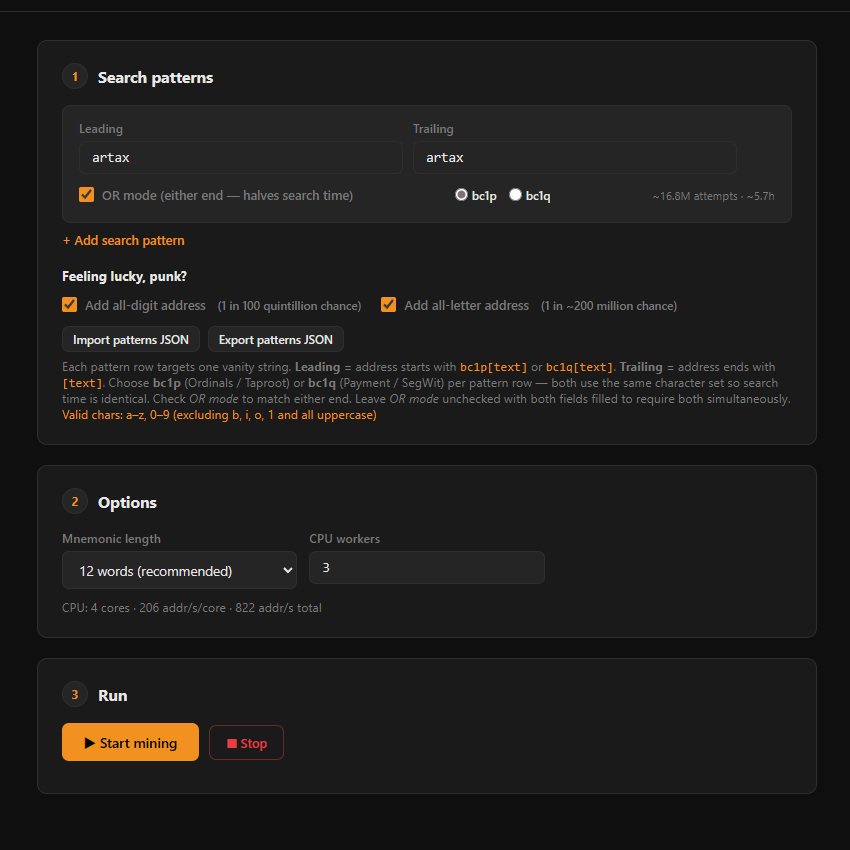

# SeedCraft — Local mnemonic crafting 

Generate a P2TR: `bc1p...` or P2WPKH: `bc1q...` vanity address for **Ordinals or Payment wallet**, one that starts and/or ends with a string of your choice, and outputs a full **BIP39 mnemonic** ready to import directly into compatible wallets (Xverse, Leather, Sparrow). Runs entirely offline on your local CPU, no compilation required.

<p align="center">
  
</p>

## Changelog

**v0.6**
- Added `bc1q` (P2WPKH / Native SegWit) vanity search support alongside `bc1p`
- Per-pattern address type selector in the UI: each pattern row has a **bc1p / bc1q** radio toggle — bc1p and bc1q patterns run in parallel at no extra cost
- New CLI config variables: `TARGET_BC1Q_PREFIX`, `TARGET_BC1Q_SUFFIX`, `TARGET_BC1Q_NOPREF`, `TARGET_BC1Q_PREFIXANDSUFFIX` — same logic as their bc1p counterparts but for BIP84 `m/84'/0'/0'/0/{index}` addresses
- bc1q derivation is skipped entirely when no bc1q patterns are configured (zero performance overhead)
- Result display highlights the matched address type (`bc1p` or `bc1q`) in both UI and CLI output
- Stop button now shows **Stopping…** while the mining processes are shutting down

**v0.5**
- Added full web UI served by a local Flask server (port 5003): pattern builder, options, live mining stats, result display
- Pattern import/export as JSON — save and reload your target lists across sessions
- Pattern list pagination (10 per page) — supports up to 1024 patterns in a single pass
- Checkpoint resume banner on page load — restores patterns and restarts mining in one click
- Live SSE stream: attempts, speed (addr/s) and ETA update every 2 seconds during mining
- "Feeling lucky, punk?" whole-address filters: **all-digit** (every char in `0–9`, 1 in 100 quintillion) and **all-letter** (every char in `a–z`, 1 in ~200 million) — checked against the full address body, not a fixed substring
- Fixed broken `only_digits` / `only_letters` logic: previously injected a literal substring into `nopref` instead of checking every character of the address
- `POST /api/result/clear` endpoint — "Purge RAM" button wipes the mnemonic from Flask's RAM.

**v0.4**
- Added `TARGET_PREFIXANDSUFFIX` parameter: search for pairs `[prefix, suffix]` where both must match simultaneously (AND logic per pair)
- Multiple pairs are supported (OR logic between pairs) — the first address matching any pair wins
- Probability calculation and checkpoint tracking updated accordingly

**v0.3**
- Added `TARGET_NOPREF` parameter: search for a pattern at the start or end simultaneously
- Returns the first match regardless of position (prefix or suffix)
- Reduces average search time by ~2x compared to prefix-only or suffix-only for the same word

**v0.2**
- Added multi-pattern search support for `TARGET_PREFIX` and `TARGET_SUFFIX`
- Allows multiple prefix and/or suffix patterns
- When both `TARGET_PREFIX` and `TARGET_SUFFIX` are filled, the search matches **either** a prefix **or** a suffix (OR logic) — use `TARGET_PREFIXANDSUFFIX` if you need both simultaneously
- Stops on first successful match
- Supports patterns of varying lengths

---

## ⚠️ Disclaimer & Security Recommendations

**Use this script at your own risk.** It handles sensitive cryptographic material (private keys derived from a mnemonic). The author takes no responsibility for lost funds, stolen keys, or any misuse.

**Strongly recommended practices:**

- **Run offline.** Disable Wi-Fi and unplug ethernet before running the script. A mnemonic generated on an internet-connected machine is a mnemonic at risk.
- **Shred, don't just delete, the result file.** After noting your mnemonic, use a file-shredding tool (e.g. [Eraser](https://eraser.heidi.ie/) on Windows, `shred` on Linux, Secure Empty Trash on macOS) to overwrite the clusters before deletion. A normal delete leaves the data recoverable.
- **Reboot after noting the mnemonic.** Warning: RAM is not guaranteed to be wiped on shutdown. To purge sensitive data, fully power off the system and disconnect it from all power sources for at least 2 minutes before restarting.
- **Enable pagefile clearing on shutdown (Windows).** Windows may swap RAM content to `pagefile.sys`. To auto-wipe it: open `regedit`, navigate to `HKLM\SYSTEM\CurrentControlSet\Control\Session Manager\Memory Management`, and set `ClearPageFileAtShutdown` to `1`.
- **Write the mnemonic on paper, not in a digital file.** If you must store it digitally, use an encrypted, air-gapped solution (e.g. VeraCrypt container on an offline drive).
- **Never share the mnemonic or the result JSON** with anyone or any service. Anyone with access to this data can take full control of your funds.
- **The `.gitignore` file is not a security guarantee.** It helps prevent accidental inclusion of sensitive files when using `git add`, but it does not guarantee protection if files are manually added or are already tracked by Git.
- **None of the above matters on a compromised machine.** If your system is already infected with a keylogger or trojan, any mnemonic you type, display, or save is potentially exposed regardless of all other precautions. For maximum security, run the script on a freshly installed OS with no network access, or on a dedicated air-gapped machine.

---

## Limitations

### Valid characters

Bitcoin `bc1p` addresses use the **bech32m** alphabet. Only the following 32 characters are valid for your vanity pattern:

```
Valid chars: a–z, 0–9 (excluding b, i, o, 1 and all uppercase)
```


### Ordinals address, not the payment address

The vanity pattern applies to the **Ordinals / P2TR address** (`bc1p...`), which is the one used to receive and hold inscriptions. The script also derives the companion payment address (`bc1q...`) for reference, but no vanity constraint is applied to it.

### Expected search time

The table below shows **average** expected times (you may finish much sooner or later):

Estimates assume **~150/s per core** (measured on a typical desktop CPU). Total throughput scales linearly with core count.

| Pattern type | Characters | Expected attempts | 4-core (~600/s total) | 16-core (~2,400/s total) |
|---|---|---|---|---|
| Prefix only | 4 | ~1 million | ~30 min | ~7 min |
| Prefix only | 5 | ~33 million | ~15 h | ~4 h |
| Suffix only | 4 | ~1 million | ~30 min | ~7 min |
| Suffix only | 5 | ~33 million | ~15 h | ~4 h |
| Prefix **+** Suffix | 4+4 | ~1 billion | ~21 days | ~5 days |
| Prefix **+** Suffix | 5+5 | ~1.1 trillion | ~58 years | ~14 years |

> The combined prefix+suffix mode is provided for completeness. In practice, anything above 4+4 is not realistic on consumer hardware.

### Compatible wallets

The generated mnemonic uses standard **BIP39** with **BIP86** derivation (`m/86'/0'/0'/0/0`) for the `bc1p` address and **BIP84** (`m/84'/0'/0'/0/0`) for the `bc1q` address. It is compatible with any wallet that supports BIP86 P2TR import, including:

- **[Xverse](https://xverse.app/)** - import as a new standalone wallet
- **[Leather (Hiro)](https://leather.io/)** - supports BIP86 for Ordinals
- **[Sparrow Wallet](https://sparrowwallet.com/)** - full BIP86 desktop wallet

> **UniSat** is generally not recommended for vanity wallets: its address model may not expose arbitrary BIP86 derivation indices directly, making import unreliable.

---

## Prerequisites

- **Python 3.8+**
- **bip_utils**
- **Flask** (for the web UI)

```bash
pip install bip_utils flask
```

---

## Usage

### 1. Start the web UI

```bash
python app.py
```

Then open **http://localhost:5003** in your browser.

### 2. Configure your target patterns

In the **Search patterns** card, add one or more patterns using the pattern builder. Each row lets you set:
- **Leading** — the address must start with this string (e.g. `dead`)
- **Trailing** — the address must end with this string (e.g. `cafe`)
- **OR mode** toggle — matches the pattern at the start **or** end (whichever comes first)

The search stops as soon as **any** pattern is matched. Searching for multiple patterns runs in parallel at no extra cost and reduces expected time proportionally — 3 prefixes of the same length find a result ~3x faster on average than a single one.

Use **Import** to load a previously exported `.json` pattern list, and **Export** to save your current list for later.

Under **"Feeling lucky, punk?"**, you can add to your search an address where **every character** of the address body is a digit (`0–9`) or a letter (`a–z`), with no mixed characters.

### 3. Set options and start

In the **Options** card, choose your mnemonic length (12 or 24 words) and the number of CPU workers. Then click **Start mining**.

Live stats (attempts, speed, ETA) update every 2 seconds via a server-sent event stream. You can click **Stop** at any time for a clean pause — the current attempt counter is saved automatically to `vanity_wallet_checkpoint.json`.

### 4. Resume and result

If a checkpoint exists when you open the UI, a **resume banner** appears at the top. Click **Resume** to restore your patterns and restart mining from where you left off, or **Discard** to clear the checkpoint and start fresh.

When a match is found, the result section displays the `bc1p` Ordinals address, the `bc1q` payment address, and the full mnemonic. Write down the mnemonic on paper, then click **Purge RAM** to wipe the mnemonic from the server's RAM.

> The checkpoint tracks the **attempt counter only**, not attempted mnemonics. Since the mnemonic space is ~2¹²⁸, the probability of generating a duplicate across sessions is negligible to the point of being cryptographically irrelevant.

### 5. After import

1. **Shred** `vanity_wallet_result.json` with a file-shredding tool
2. Import the mnemonic into your wallet as a **new standalone seed** (not mixed with an existing wallet)
3. **Reboot** your machine to clear RAM
4. Delete `vanity_wallet_checkpoint.json` (no longer needed)

---

## Output files

| File | Purpose | Delete when? |
|---|---|---|
| `vanity_wallet_result.json` | Mnemonic + addresses | Shred **Immediately** after noting your mnemonic |
| `vanity_wallet_checkpoint.json` | Resume counter between sessions | Delete after the address is found |

> Both files are saved directly to your **Desktop** (`~/Desktop`) on Windows/MacOs/Linux regardless of where the script is run from, so they are always easy to locate.
